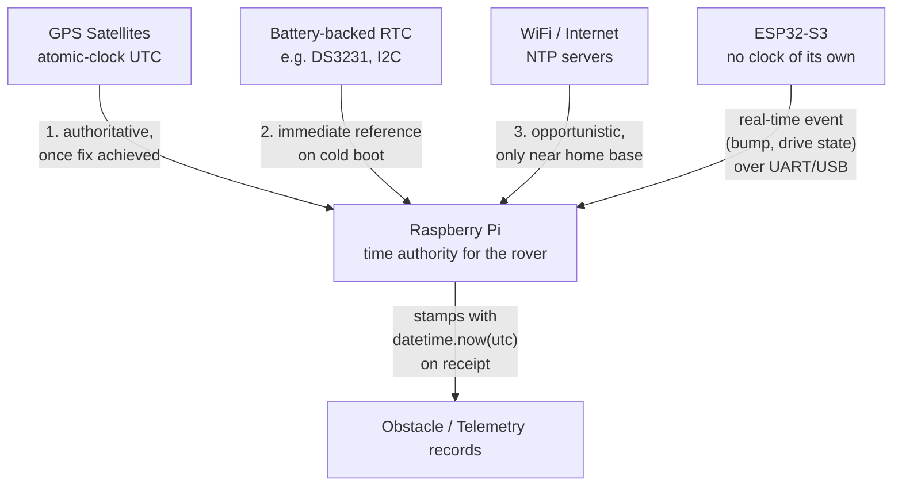

# Time Synchronization Across the Rover System

Reference notes on how the rover establishes and maintains a trustworthy
notion of wall-clock time, and how that interacts with the different
boards and sensors onboard. Written 2026-09-24 during MP-1 planning;
candidate for a future UI FAQ entry.

## Why this matters

Telemetry and obstacle records need consistent, correctly-ordered
timestamps across every source that produces them (Pi mission software,
ESP32-relayed events, GPS fixes) so a human troubleshooting the rover
later can actually trust and correlate the data. Getting this wrong
doesn't crash anything — it just quietly produces plausible-looking,
wrong timestamps, which is worse than an obvious failure.

## Time sources, in priority order

1. **GPS** (once a fix is achieved) — authoritative. GPS satellites carry
   atomic-clock-derived UTC as part of their signal, accurate to the
   microsecond, and available with **zero internet/WiFi required**. This
   matters specifically for this rover, since its whole purpose is
   operating in areas without WiFi coverage — GPS is a *better* fit here
   than NTP, not just a fallback for when NTP isn't available.
2. **A battery-backed RTC** (recommended hardware addition — not yet in
   the BOM) — gives an immediately reasonable time reference on a cold
   boot, before GPS has a fix. Cheap, I2C, low risk. See "Hardware
   recommendation" below.
3. **WiFi / NTP**, opportunistically — useful at boot if the rover
   happens to be near the home base with WiFi already available, but
   not something to depend on given the mission profile.
4. **The Pi's own uncorrected system clock** — last resort. Raspberry Pi
   5 has no RTC by default, so without one of the sources above, a cold
   boot's clock could be meaningfully wrong (e.g. reset to a default
   epoch).

## Architecture: the Pi is the single time authority

- The Pi corrects its OS clock from GPS (ideally via `gpsd` feeding
  `chrony` — the standard "GPS-disciplined clock" pattern) and/or NTP
  and/or an RTC, once added. This is OS/system configuration, not
  application code — every `datetime.now(utc)` call anywhere in the
  Pi's Python code is then just correct, with no bespoke offset-tracking
  logic needed in the mission software itself.
- **The ESP32 needs no clock of its own.** It has no RTC and no
  independent WiFi/GPS access in this architecture (the Pi owns comms).
  Rather than building a time-sync protocol between the two boards, the
  ESP32 just relays real-time events (bump contact, drive state) over
  the existing low-latency UART/USB link, and **the Pi stamps them with
  its own `datetime.now(utc)` the instant it receives them.** Serial-link
  latency there is microseconds to low milliseconds — negligible for a
  slow-moving rover with GPS updating a few times a minute.
- `position_fusion.py`'s internal `timestamp` fields (see the [MP-1
  Position & Coverage Geometry](../superpowers/plans/2026-09-24-mp1-position-coverage-geometry.md)
  and [Obstacle Detection & Classification](../superpowers/plans/2026-09-24-mp1-obstacle-detection-classification.md)
  plans) are deliberately **monotonic seconds**, not wall-clock time —
  unaffected by anything on this page. Dead reckoning only needs
  reliable elapsed-time deltas between readings, and wall-clock time can
  jump on a correction, which would corrupt that math.

## Hardware recommendation: add a battery-backed RTC

A coin-cell RTC module (DS3231-class, I2C, ~$5-10) removes the "no
reliable time reference on a cold field boot" problem almost entirely,
rather than requiring software to work around it — e.g. the scenario
where a battery dies away from home base and gets swapped for a charged
one in the field, with no GPS fix and no WiFi yet available. Recommended
addition to the BOM and the upcoming PCB respin. Low cost, low
complexity, low risk — exactly the kind of problem hardware should solve
so software doesn't have to.

## Degraded scenario: no GPS fix, no WiFi, no RTC (or RTC failed)

Worth having an explicit, deliberately simple answer for this rather
than pretending it can't happen:

- **Don't attempt to retroactively reconstruct exact timestamps** for
  the affected window once GPS/NTP is eventually regained. There's no
  reliable way to know the clock's drift *rate* during the outage, so a
  "corrected" value would be a guess dressed up as data.
- Instead, tag affected records with a lightweight `time_confidence`
  marker — `"synced"` once the Pi's clock has been corrected by GPS/NTP/
  RTC since boot, `"unconfirmed"` before that. Don't touch the
  timestamp values themselves.
- **Relative ordering within an "unconfirmed" window is still
  trustworthy** — the clock keeps counting forward even with a wrong
  epoch, so event sequence and elapsed-time reasoning both still hold.
  Only the absolute placement on the UTC timeline is in question.
- This is deliberately the cheap, low-complexity answer for what's a
  rare, non-mission-critical edge case. Building real reconciliation
  logic for it isn't worth it — the RTC recommendation above is the
  actual fix; this is just the honest fallback for if that hardware
  isn't there yet or fails.

## Diagram

## Where this lands in the implementation plans

- **Mission Flow plan** (not yet written): treat "Pi clock corrected via
  GPS/NTP/RTC since boot" as a startup precondition, and set
  `time_confidence` on records accordingly during any window where it
  hasn't been.
- **Sensor-drivers / system-configuration work** (not yet a plan):
  `gpsd` + `chrony` setup, RTC driver and I2C wiring, once the hardware
  plan reaches that point.
