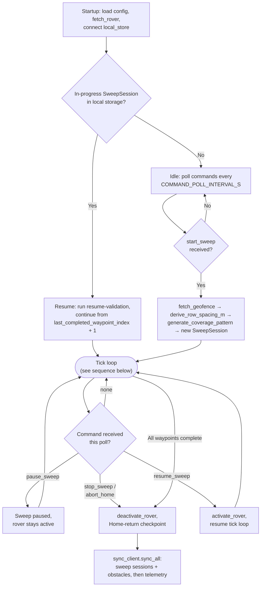
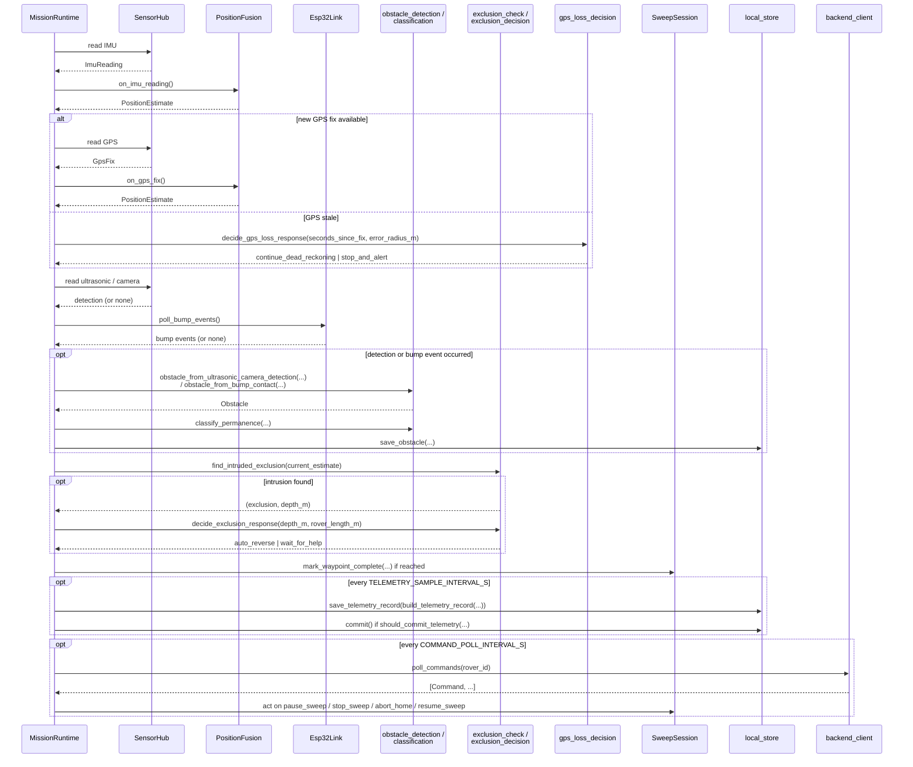

# MP-1 Mission Runtime — Design Notes (in progress)

*Working draft, updated live during brainstorming. Not yet approved.*

This is the orchestrator that ties together the four already-approved
Pi-mission plans — Position & Coverage Geometry, Obstacle Detection &
Classification, Mission Flow Decision Logic, and Pi Local Store & Sync
Client — plus the Backend Core plan (currently being built by subagents in
parallel with this design session), into one running process on the Pi.

## Decisions made so far

| Question | Decision |
|---|---|
| Execution model | Single-threaded synchronous tick loop (not asyncio, not multi-threaded) |
| Pi↔ESP32 dependency | Define the Python-side interface now (`Esp32Link`); actual firmware/wire protocol is a separate, later plan that must conform to it |
| Overall structure | Thin orchestrator (`runtime.py`) that sequences calls into already-tested modules — no new business logic, no event bus. If MP-2–MP-4 later need pub-sub, that refactor stays contained to `runtime.py` since every other module is already decoupled |
| Crash/power-loss recovery | Auto-resume: on restart, if local storage has an in-progress `SweepSession`, treat it like any other interruption — run resume-validation, continue from `last_completed_waypoint_index + 1`. No operator action required |
| Loop timing (named constants, all overridable) | `TICK_HZ = 10` (100ms tick: IMU sample + sensor checks), `COMMAND_POLL_INTERVAL_S = 1.0`, `TELEMETRY_SAMPLE_INTERVAL_S = 5.0` (separate from the existing 60s SQLite commit-batching interval) |

## Architecture & file structure

A gap surfaced while mapping this out: none of the four existing
Pi-mission plans include a client for *reading* from the backend (fetching
the active rover's config, fetching a geofence, polling/acking commands) —
`sync_client.py` only *pushes* data up. Mission Runtime needs both
directions, so a new `backend_client.py` owns the read/poll side.

```
pathfinder-autonomous/pi-mission/papaya_mission/
  runtime.py          # NEW — the thin orchestrator: MissionRuntime, run_mission_loop()
  sensor_hub.py        # NEW — Protocol interfaces: GpsSource, ImuSource, UltrasonicSource,
                        #        CameraSource + a SimulatedSensorHub for tests. Real hardware
                        #        drivers deferred to a future hardware-integration pass, same
                        #        as every other Pi-mission plan treats sensor acquisition.
  esp32_link.py         # NEW — Esp32Link interface: poll_bump_events(), status(),
                        #        send_geofence_update(), trigger_ota(). Contract only — real
                        #        UART/I2C wire protocol is the ESP32 firmware plan's job,
                        #        designed to match this. status() lets Mission Runtime check
                        #        for a halted-on-contact state after a link outage before
                        #        resuming movement commands (see Error handling).
  runtime_config.py     # NEW — TICK_HZ, COMMAND_POLL_INTERVAL_S, TELEMETRY_SAMPLE_INTERVAL_S,
                        #        rover_id/backend_base_url/local_db_path loaded from .env
                        #        (same convention as backend/)
  backend_client.py     # NEW — fetch_rover(), fetch_geofence(), poll_commands(), ack_command()
                        #        — the read/poll half; sync_client.py (already planned) is the
                        #        push half
  __main__.py           # NEW — CLI entrypoint: load config, construct MissionRuntime, run
```

Everything else (`position_fusion`, `coverage_pattern`, `exclusion_check`,
`row_spacing`, `obstacle_detection`, `classification`, `sweep_session`,
`exclusion_decision`, `gps_loss_decision`, `resume_validation`,
`local_store`, `telemetry_record`, `sync_client`) is consumed as-is from
the four already-approved plans — `runtime.py` calls into them, owns none
of their logic.

## Mission lifecycle / data flow



1. **Startup.** Load config (`.env`: `ROVER_ID`, `BACKEND_BASE_URL`,
   `LOCAL_DB_PATH`) → `backend_client.fetch_rover(rover_id)` for
   dimensions/turn_style/sensor_manifest → open
   `local_store.connect(LOCAL_DB_PATH)` → **check for an in-progress
   `SweepSession` in local storage.** If found, treat it exactly like a
   resume-from-interruption: run resume-validation, continue from
   `last_completed_waypoint_index + 1`. If none found, sit idle, polling
   commands every `COMMAND_POLL_INTERVAL_S`, waiting for `start_sweep`.

2. **`start_sweep` received.** `backend_client.fetch_geofence(...)` →
   `row_spacing.derive_row_spacing_m(...)` →
   `coverage_pattern.generate_coverage_pattern(...)` → build a new
   `SweepSession` → begin the tick loop.

3. **Each tick (every `1/TICK_HZ` s).** Sample IMU →
   `PositionFusion.on_imu_reading()`; consume a GPS fix if the `SensorHub`
   has a new one → `on_gps_fix()`; check ultrasonic/camera/bump (via
   `Esp32Link.poll_bump_events()`) → run `obstacle_detection` →
   `classify_permanence`; check `exclusion_check.find_intruded_exclusion`
   against `current_estimate` → `exclusion_decision.decide_exclusion_response`
   if intruded; if no GPS fix recently,
   `gps_loss_decision.decide_gps_loss_response`; advance
   `SweepSession.mark_waypoint_complete` as waypoints are reached; every
   `TELEMETRY_SAMPLE_INTERVAL_S`,
   `telemetry_record.build_telemetry_record(...)` →
   `local_store.save_telemetry_record`, and call `local_store.commit()`
   whenever `should_commit_telemetry(...)` says so; every
   `COMMAND_POLL_INTERVAL_S`, `backend_client.poll_commands(rover_id)` and
   act on `pause_sweep`/`stop_sweep`/`abort_home`/`update_geofence`.

**Every object `runtime.py` touches in one tick:**



This is the concrete picture behind the scaling note above — ten participants
already in scope on a single tick at MP-1's baseline scope, which is exactly
why per-tick duration gets logged and watched as later mission packages add
more.

4. **Home-return checkpoint (mission complete, or `abort_home`).**
   `sync_client.sync_all(conn, client, base_url)` pushes everything
   unsynced — sweep sessions and obstacles before telemetry, per that
   plan's ordering.

## Scaling note — revisit trigger for the single-threaded model

**User feedback (2026-09-25):** the sequential per-tick work in step 3 is
acceptable for MP-1, but if MP-2–MP-4 keep adding more sequential work to
every tick, the single-threaded synchronous model should be revisited in
favor of something more concurrent (async or multi-threaded) to keep
scaling.

**Decision:** don't build that now — YAGNI still applies, and building
concurrency machinery speculatively risks solving the wrong problem (per
the same reasoning that ruled out the event-bus approach). Instead, the
Mission Runtime implementation plan will include a concrete, measured
trigger to revisit this: `runtime.py` logs actual per-tick duration, and
if it starts regularly approaching the `TICK_HZ` budget (100ms at the
default rate), that's the signal to stop adding work to the synchronous
loop and revisit the execution model — before it becomes a real missed-tick
problem, not after. This makes the tradeoff self-reporting rather than
something we have to remember to reassess manually as later mission
packages are designed.

## Error handling

**General policy: fault-isolate per subsystem within the tick.** A failure
reading one sensor, polling commands, or syncing to the backend does not
stop the mission — it's logged and treated as a momentary "missing"
reading for that tick, and the loop continues. This is exactly what the
local-store store-and-forward design (already approved in the Pi Local
Store & Sync Client plan) exists to tolerate — a rover working a field is
expected to lose WiFi to the backend routinely.

| Failure | Response |
|---|---|
| Ultrasonic / camera read failure | Log, treat as no detection this tick, continue. |
| GPS fix missing / stale | Already covered by the approved design: feed time-since-last-fix into `gps_loss_decision.decide_gps_loss_response` — may itself resolve to `stop_and_alert` if the error circle grows past the threshold, but that's the existing decision function's call, not a new Mission Runtime policy. |
| IMU read failure | Treated the same as a GPS gap for dead-reckoning purposes — position estimate can't safely advance, feeds into the same `gps_loss_decision` path. |
| Backend unreachable (command poll, sync) | Log, retry next interval. Never blocks the tick loop. |
| Local SQLite write failure | Log loudly (rare — SD card fault), continue; telemetry/obstacle loss is not itself a safety issue. |
| **ESP32 link drops** | **Log and continue** — not a safety event. Per the already-approved design spec (Architecture — Sensing), bump-sensor contact triggers an immediate stop *at the ESP32 firmware level*, with no round-trip through the Pi — so the hard-stop safety behavior is independent of whether Mission Runtime can currently reach the board. Losing the link only means logging/telemetry of bump events is delayed, not that collision safety is compromised. |
| **ESP32 link reconnects** | Before resuming any movement command, call `Esp32Link.status()` to check whether the board is currently halted-on-contact (a bump could have occurred *during* the outage). If halted, treat it like any other bump event — stop the sweep and flag for operator/resume-validation — rather than blindly resuming. |

## Testing strategy

Follows the same pattern already established across the four approved
Pi-mission plans: pure functions/classes tested directly with pytest, no
mocking of anything that has real correctness properties.

- `sensor_hub.py` ships a `SimulatedSensorHub` (scripted fixture readings) implementing the same `GpsSource`/`ImuSource`/`UltrasonicSource`/`CameraSource` protocols the real hardware drivers will later implement — `runtime.py`'s tests inject it, never touching real hardware.
- `esp32_link.py` gets an equivalent in-memory fake for tests (scripted bump events / status responses / send calls recorded for assertion).
- `backend_client.py` and `sync_client.py` (already approved) both test against `httpx.MockTransport` — the same pattern, no live HTTP server needed.
- `runtime.py`'s own tests exercise full tick sequences against these fakes: e.g. "fake ultrasonic reports an obstacle → obstacle gets classified and saved to local_store," "fake ESP32 reports halted-on-contact after a scripted link outage → sweep pauses before resuming," "fake backend returns a `stop_sweep` command → sweep session transitions to interrupted." This is where the orchestration logic itself gets verified, distinct from the already-tested logic inside each module it calls.
- An integration test (mirroring every other plan's Task 6) drives a short simulated mission end-to-end: start_sweep → a few ticks with scripted sensor/command events → stop_sweep → sync — proving the wiring, not re-testing any module's internals.
